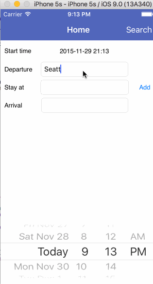

# iOS Roadie
## Team members
- Robin Wu
- Xin Suo
- Dawei Wang

## User Stories

**Version 1.0** [Required]

- [ ] Home page should have following functionality
	- [ ] Default to load Google Maps
	- [ ] Users should be able to select departure date and time
	- [ ] Two text fields where users can input starting point and destination, they should support destination auto complete
	- [ ] When users finish inputing, call Google Maps API to get route information
	- [ ] A subview where users can browse hotel deals images, hotel deals should come from certain distance along the route (mock)
- [ ] Hamburger menu
	- [ ] Login: this should redirect users to login page
	- [ ] Logout
- [ ] Login page
	- [ ] Login with Facebook
	- [X] Login with username & password
	- [X] Sign up with Parse
- [ ] Deal details page
	- [ ] Image view of hotels, hotel description, price, location, book button
	- [ ] After users finish booking, users are asked to select checkout time and pops back to home page with updated route information

**Version 2.0** [Optional]

- [ ] Home page improvement
	- [ ] Hotels are selected based on live calls
	- [ ] Google Maps is hotspotted with location of the deal (the first of deals)
	- [ ] Home page should have 4 subviews in total: Map, Food, Hotel, Things to do
- [ ] Deal details page improvement
	- [ ] Users are able to browse through photos gallery

**Version 3.0** [Optional]

- [ ] Users are able to save their planned trip, public or private
- [ ] Hamburger menu
	- [ ] My Trips: this should redirect users to my trips page
- [ ] My Trips page
	- [ ] Display a list of trips users saved
- [ ] Trip details page
	- [ ] Load Google Maps along with route information and deals information

**Version 4.0** [Optional]

- [ ] Hamburger menu
	- [ ] Inspire Me: this should redirect users to inspire me page
- [ ] Inspire Me page
	- [ ] Users are able to view others road trips based on starting point and destination
- [ ] Trip details page
	- [ ] Users are able to comment, rating etc

**Version 5.0** [Optional]

- [ ] Trip details page
	- [ ] Users are able to upload images
	- [ ] Share on Facebook

**Version 6.0** [Optional]

- [ ] Integrate with third party on real deals
- [ ] Hamburgers page
	- [ ] Profile: users are able to add payment method

## Video Walkthrough

Here's a walkthrough of implemented user stories:

GIF created with [LiceCap](http://www.cockos.com/licecap/).
